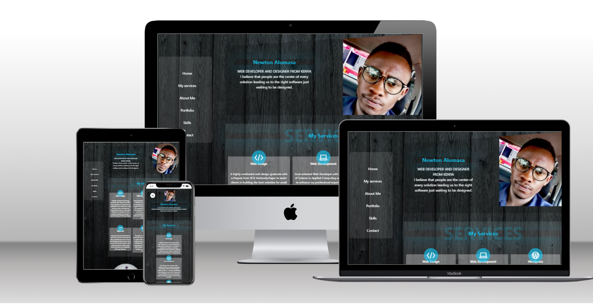

# Portfolio


> My Personal Portfolio

**Additional description about the project and its features.**
This is my personal portfolio to show case my recent projects and current front-end and back-end technologies.

## Linter for html&css (Stylelint)
- [stylelint](https://github.com/microverseinc/linters-config/tree/master/html-css)

## linter for html&css + javascript (ESlint)
- [ESlint](https://github.com/microverseinc/linters-config/tree/master/html-css-js)

## ⚒️ Built With

- HTML & SASS & BOOTSTRAP & FLEX & JAVASCRIPT
- Media queries

## Run Project

- `npm install node-sass --save-dev`
- `npm run compile:sass`
- `npm install live-server`
- `live-server`

## Live Demo
- [My portfolio](https://altontonn.github.io/tech-pro/)

## 🧰 Tools

The following tools help make it easier to run this code.

- [Visual Studio Code](https://code.visualstudio.com/): A source code editor
- XAMPP
- Git

## 🔥 Getting Started

If you installed git you can clone the code to your machine, or download a ZIP of all the files directly.
[Download the ZIP from this location](https://github.com/altontonn/tech-pro/archive/refs/heads/main.zip), or run the following [git](https://git-scm.com/downloads) command to clone the files to your machine:

```bash
git https://github.com/altontonn/tech-pro.git
```

- Once the files are downloaded or cloned on your machine, open the "Portfolio" folder in [Visual Studio Code(VSCode)](https://code.visualstudio.com/)
- Optionally you can simply open the index.html file located in the "personal-portfolio" folder with your preferred browser

## 🙎🏾‍♂️ Author

- GitHub: [Newton Alumasa](https://github.com/altontonn)
- Twitter: [Newton Alumasa](https://twitter.com/AlumasaNewton)
- LinkedIn: [Newton Alumasa](https://linkedin.com/in/NewtonAlumasa)

## 👊🏾 Show your support

Give a ⭐️ if you like this project!

## 📝 License

This project is [MIT](./LICENSE) licensed.
